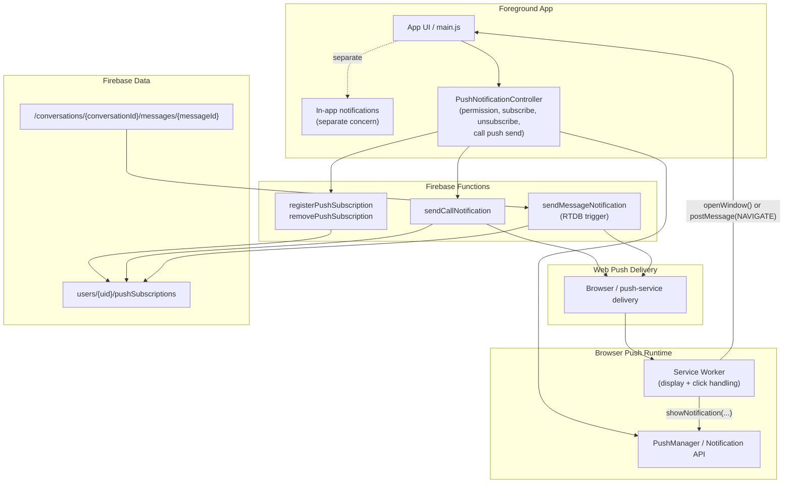

# Notifications Web Push Handoff

## Status

This is still a **verification-first implementation slice**, not the final notification architecture.

The good news is that the active Web Push path is now working end-to-end on the deployed app, including iPhone Home Screen PWA behavior. The remaining work is mostly **cleanup, boundary clarification, and simplification**, not proving basic feasibility anymore.

Current implementation checkpoint branch:

- `codex/notifications-phase-1`

Current refactor branch:

- `codex/push-notifications-refactor`

Current PR:

- [#409](https://github.com/KristinnRoach/HangVidU/pull/409)

Latest refactor checkpoint on refactor branch:

- `faedde6` - `Refactor backend push notification modules`

Latest checkpoint status:

- the first structure-refactor slice has been deployed from `codex/push-notifications-refactor`
- that deployed refactor slice was manually tested and confirmed working
- current understanding is that the refactor branch remains functionally equivalent to the previously working notification flows for the covered scenarios
- the push-focused `src/sw.js` split has now been completed and manually verified after redeploy
- missed-call notification tap routing was corrected so it no longer drops into the empty-room "Share this link" path
- backend push logic has now been split under `functions/push-notifications/*`
- [functions/index.js](/Users/kristinnroachgunnarsson/Desktop/Dev/HangVidU/functions/index.js) is now Firebase export wiring only
- legacy `call` compatibility has now been removed from backend/shared runtime paths so canonical push payloads are `incoming_call`, `missed_call`, and `message`

## Fresh Context Start Here

If starting from a fresh session, assume the following is already true:

- `codex/notifications-phase-1` is the known-good rollback/checkpoint branch
- `codex/push-notifications-refactor` is the active branch for continuing the structural cleanup
- shared push schemas now exist under [shared/push-notifications](/Users/kristinnroachgunnarsson/Desktop/Dev/HangVidU/shared/push-notifications)
- the app now has a public push barrel at [index.js](/Users/kristinnroachgunnarsson/Desktop/Dev/HangVidU/src/push-notifications/index.js)
- legacy import paths still exist as compatibility shims so behavior remains stable while imports are migrated
- backend push modules now live under [functions/push-notifications](/Users/kristinnroachgunnarsson/Desktop/Dev/HangVidU/functions/push-notifications), with [index.js](/Users/kristinnroachgunnarsson/Desktop/Dev/HangVidU/functions/index.js) reduced to Firebase export wiring
- the next major slices are still:
  - continue migrating from old notification paths to the new push-specific structure
  - continue removing remaining legacy compatibility shims outside the backend/shared runtime boundary

## Current Implementation And Integration Status

### What is currently integrated

- [index.js](/Users/kristinnroachgunnarsson/Desktop/Dev/HangVidU/src/push-notifications/index.js) is now the intended public app import boundary for push notifications on the refactor branch.
- [push-notifications.js](/Users/kristinnroachgunnarsson/Desktop/Dev/HangVidU/src/push-notifications/push-notifications.js) is now the app-facing push facade on the refactor branch.
- [push-notification-controller.js](/Users/kristinnroachgunnarsson/Desktop/Dev/HangVidU/src/notifications/push-notification-controller.js) still exists as a compatibility shim during the refactor.
- [main.js](/Users/kristinnroachgunnarsson/Desktop/Dev/HangVidU/src/main.js) initializes the push controller at app startup.
- on login / initial authenticated load, `enableIfGranted()` is called so existing permission can be activated without prompting automatically.
- if permission has not yet been granted, the app shows the in-app enable prompt from [enable-notifications-prompt.js](/Users/kristinnroachgunnarsson/Desktop/Dev/HangVidU/src/ui/components/notifications/enable-notifications-prompt.js).
- on logout, the current browser subscription is unsubscribed and removed from the backend.
- successful outgoing call start in [main.js](/Users/kristinnroachgunnarsson/Desktop/Dev/HangVidU/src/main.js) immediately sends a push through the backend `sendCallNotification` HTTP function.
- missed calls are currently sent through that same backend call notification path during call cleanup.
- message push delivery is currently server-driven: the Firebase RTDB trigger `sendMessageNotification` sends Web Push when a new conversation message is created.
- backend push logic is now split under [functions/push-notifications](/Users/kristinnroachgunnarsson/Desktop/Dev/HangVidU/functions/push-notifications), while [index.js](/Users/kristinnroachgunnarsson/Desktop/Dev/HangVidU/functions/index.js) only wires Firebase exports.
- [sw.js](/Users/kristinnroachgunnarsson/Desktop/Dev/HangVidU/src/sw.js) is now a thin service-worker entrypoint that wires push handling into internal modules under [src/push-notifications/sw](/Users/kristinnroachgunnarsson/Desktop/Dev/HangVidU/src/push-notifications/sw).
- when the app is already open, the service worker now posts a `NAVIGATE` message back into the app so notification taps still route into the intended room/contact.
- missed-call notification taps now route to the caller contact first, with room fallback only if caller identity is unavailable.
- canonical shared push contracts now exist in [shared/push-notifications](/Users/kristinnroachgunnarsson/Desktop/Dev/HangVidU/shared/push-notifications), with [schema.js](/Users/kristinnroachgunnarsson/Desktop/Dev/HangVidU/src/notifications/schema.js) currently acting as a compatibility re-export layer

### What is verified working

Verified manually on the deployed site:

- real text message notifications while the app/browser is closed or the phone is locked
- real file message notifications while the app/browser is closed or the phone is locked
- real missed call notifications while the app/browser is closed or the phone is locked
- manual debug call notification to a target contact
- real incoming call notification at call start while the app/browser is closed or in background
- tapping the real incoming call notification now opens/focuses the app and joins the intended call
- tapping the missed-call notification now avoids the empty-room share-link path and routes into caller context correctly
- the first refactor slice deployed from `codex/push-notifications-refactor` still works in manual post-deploy testing

### What is implemented but still provisional

- the contacts list still includes a temporary debug button for sending a targeted call push
- temporary sender-side, backend, and service-worker diagnostics are still present
- `window.pushNotificationController` is still exposed for manual testing
- subscription ownership now uses a `pushSubscriptionOwners/{subscriptionId}` index, with a legacy full-user scan fallback only when an older subscription has not yet been indexed
- the legacy ownership fallback was reviewed during the backend split and intentionally left in place for now because removing it cleanly likely needs a deliberate migration or data-state decision

### What is still incomplete or uneven

- [push-notification-controller.js](/Users/kristinnroachgunnarsson/Desktop/Dev/HangVidU/src/notifications/push-notification-controller.js) has no real client-side `sendMessageNotification()` implementation; message pushes currently bypass that controller and are sent only from the backend RTDB trigger
- incoming call notifications no longer expose a `decline` action; tapping the notification opens the app into the answer/join path
- the service worker reuse path currently focuses `clients[0]`, which is acceptable for verification but is not a strong multi-tab ownership model

## Very Important Separation

Do **not** mix these two systems:

1. In-app UI notifications:
   - [in-app-notification-manager.js](/Users/kristinnroachgunnarsson/Desktop/Dev/HangVidU/src/ui/components/notifications/in-app-notification-manager.js)
   - prompt/toast/list UX inside the app shell

2. Web Push / system notifications:
   - [index.js](/Users/kristinnroachgunnarsson/Desktop/Dev/HangVidU/src/push-notifications/index.js)
   - [push-notifications.js](/Users/kristinnroachgunnarsson/Desktop/Dev/HangVidU/src/push-notifications/push-notifications.js)
   - [sw.js](/Users/kristinnroachgunnarsson/Desktop/Dev/HangVidU/src/sw.js)
   - [functions/index.js](/Users/kristinnroachgunnarsson/Desktop/Dev/HangVidU/functions/index.js)
   - [functions/push-notifications](/Users/kristinnroachgunnarsson/Desktop/Dev/HangVidU/functions/push-notifications)
   - push subscription storage under `users/{uid}/pushSubscriptions`

These should stay separate so the system remains understandable and reusable.

## Current Architecture

This is the simplest accurate mental model of the current system:

- the app decides **when** a push-worthy event happened
- the push controller translates browser capability into a backend call
- Firebase Functions own subscription registration and delivery fan-out
- the service worker owns display of system notifications and notification click translation
- the app owns actual in-app navigation, call join logic, message UI, and foreground-only UX

## Recommended Reusable Ownership Model

If the goal is to keep this easy to reuse in other apps, the clean boundary should be:

- **App domain layer**: decides that a domain event happened, for example `incoming_call`, `missed_call`, or `new_message`
- **Push application service**: converts that event into a normalized push payload and calls one backend send API
- **Push backend gateway**: owns subscription persistence, delivery fan-out, stale subscription cleanup, and provider-specific constraints like VAPID/topic rules
- **Service worker presentation layer**: converts payloads into native notifications and click intents
- **App navigation layer**: receives those click intents and decides how to open the correct screen / room / conversation

That keeps transport, display, and app behavior decoupled.

## Latest Confirmed Findings

The Web Push pipeline itself is proven working, including real incoming call delivery.

The original “real incoming call notification does not display” problem is no longer likely to be:

- iPhone/PWA push support
- VAPID setup
- subscription storage
- the service worker display path in isolation
- payload shape or notification `type` mismatch

Latest verified findings:

- the real outgoing call flow in [main.js](/Users/kristinnroachgunnarsson/Desktop/Dev/HangVidU/src/main.js) does reach `sendCallNotification()` on call start
- sender-side logs now include local user identity, target user identity, payload shape, and backend delivery result
- receiver-side logs now include local service-worker identity and intended target user identity
- a stale cross-user subscription bug was confirmed: one of user A's browser subscriptions was stored under user B's `pushSubscriptions`
- backend registration has now been hardened so a subscription endpoint is removed from other users before being registered to the current authenticated user
- after removing stale subscriptions and re-registering cleanly, cross-user delivery stopped reproducing
- subscription registration now uses a direct ownership index for normal cleanup and only falls back to the old full-user scan for legacy unindexed subscriptions
- on the receiving device, the service worker logs `Web push received` for the real incoming call
- the debug button next to a contact reliably shows an incoming call notification on the target device
- missed call notifications still appear reliably
- the real incoming-call display failure was ultimately fixed by giving each call push a unique notification identity per attempt instead of reusing the stable room-based identity
- the first topic-based version of that fix failed because Web Push topics must be at most 32 URL-safe characters; hashing the notification identity down to a valid topic resolved that
- real incoming call pushes now succeed again with `successCount: 1` and `failureCount: 0` in the current clean test state

## What Was Actually Wrong

There were two real issues uncovered during debugging:

1. subscription ownership contamination:
   - a browser push subscription ended up stored under multiple users
   - this caused user A to receive pushes intended for user B during testing

2. real call notifications reused a stable room-based notification identity:
   - debug pushes used a fresh identity each time and displayed reliably
   - real call-start pushes reused the same room-based identity
   - moving to a unique per-attempt call notification identity fixed the display problem
   - the backend `topic` must remain within the Web Push length/character limit, so the unique notification ID is hashed before being used as a topic

## Test Coverage Status

Current automated coverage around this slice:

- [schema.test.js](/Users/kristinnroachgunnarsson/Desktop/Dev/HangVidU/src/notifications/__tests__/schema.test.js): shared push-schema coverage, including canonical vs legacy-compatible payload handling
- [push-notification-controller.test.js](/Users/kristinnroachgunnarsson/Desktop/Dev/HangVidU/src/notifications/__tests__/push-notification-controller.test.js): unit coverage for permission flow, register/unregister, direct call send, debug send, and dismiss behavior
- [notification-presentation.test.js](/Users/kristinnroachgunnarsson/Desktop/Dev/HangVidU/src/push-notifications/sw/__tests__/notification-presentation.test.js): focused service-worker push presentation coverage for tags, actions, and canonical call handling
- [notification-click-handler.test.js](/Users/kristinnroachgunnarsson/Desktop/Dev/HangVidU/src/push-notifications/sw/__tests__/notification-click-handler.test.js): focused service-worker click-routing coverage for `incoming_call`, `missed_call`, and `message`
- [call-contact-push-notification.test.js](/Users/kristinnroachgunnarsson/Desktop/Dev/HangVidU/tests/integration/call-contact-push-notification.test.js): integration coverage proving `callContact()` attempts the push immediately on successful call start
- [service-worker-sanity.test.js](/Users/kristinnroachgunnarsson/Desktop/Dev/HangVidU/tests/smoke/service-worker-sanity.test.js): environment/configuration sanity checks
- [service-worker-registration.spec.js](/Users/kristinnroachgunnarsson/Desktop/Dev/HangVidU/tests/e2e/service-worker-registration.spec.js): service worker registration/scope/control checks

The largest remaining gap is not “does the pipeline exist?” but “is the final ownership model stable enough to justify more durable end-to-end regression tests?”

## Recommended Next Step

Start the next session with notification architecture cleanup and simplification, not new feature work.

Do not broaden the scope beyond clarifying API and ownership boundaries for notifications.

Recommended next step now:

1. continue the refactor from `codex/push-notifications-refactor`, not from the checkpoint branch
2. continue migrating app imports and responsibilities toward the new push-specific structure
3. remove temporary debug hooks and logs or dev-gate them
4. keep the legacy ownership fallback unchanged unless that work also includes an explicit migration or cleanup decision
5. add regression tests after the backend structure is settled enough that the tests will not churn with the refactor

This is now a clean session boundary:

- the backend split is committed
- the current shape is documented
- the next slice can start from app/runtime cleanup without needing unstaged backend-structure context

Use [notifications-potential-cleanup-redundant-code-blocks-and-files.md](/Users/kristinnroachgunnarsson/Desktop/Dev/HangVidU/docs/notifications-potential-cleanup-redundant-code-blocks-and-files.md) as the source of truth for deferred cleanup items, temporary debug surface, and still-valid follow-up issues.

Before testing again:

- make sure both the latest app bundle and the latest service worker from this branch are active on the test devices, otherwise notification-click debugging can be misleading
