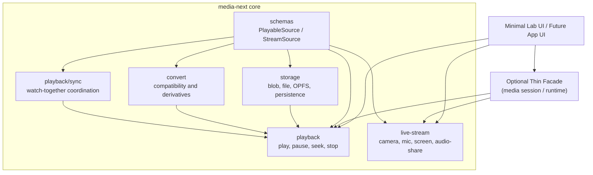

# Media Next Diagram

```mermaid
flowchart TD
    UI["Minimal Lab UI / Future App UI"]
    Facade["Optional Thin Facade\n(media session / runtime)"]

    subgraph Core["media-next core"]
      Schemas["schemas\nPlayableSource / StreamSource"]
      Playback["playback\nplay, pause, seek, stop"]
      Live["live-stream\ncamera, mic, screen, audio-share"]
      Sync["playback/sync\nwatch-together coordination"]
      Storage["storage\nblob, file, OPFS, persistence"]
      Convert["convert\ncompatibility and derivatives"]
    end

    UI --> Facade
    UI --> Playback
    UI --> Live

    Facade --> Playback
    Facade --> Live

    Schemas --> Playback
    Schemas --> Live
    Schemas --> Sync
    Schemas --> Storage
    Schemas --> Convert

    Storage --> Playback
    Convert --> Playback
    Sync --> Playback
```
