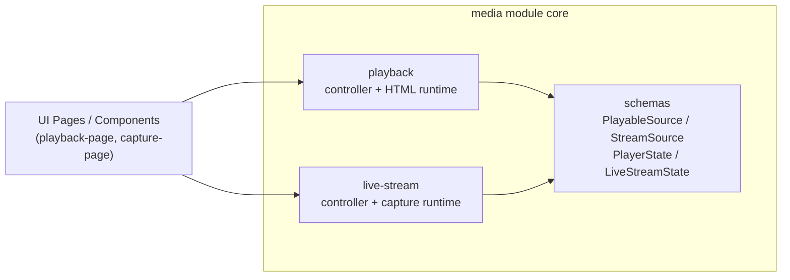

```mermaid
%%{init: {'flowchart': {'nodeSpacing': 80, 'rankSpacing': 100}}}%%
flowchart LR
    UI["UI Pages / Components<br/>(playback-page, capture-page)"]

    subgraph Core["media module core"]
      Schemas["schemas<br/>PlayableSource / StreamSource<br/>PlayerState / LiveStreamState"]
      Playback["playback<br/>controller + HTML runtime"]
      Live["live-stream<br/>controller + capture runtime"]
    end

    UI --> Playback
    UI --> Live
    Playback --> Schemas
    Live --> Schemas
```
